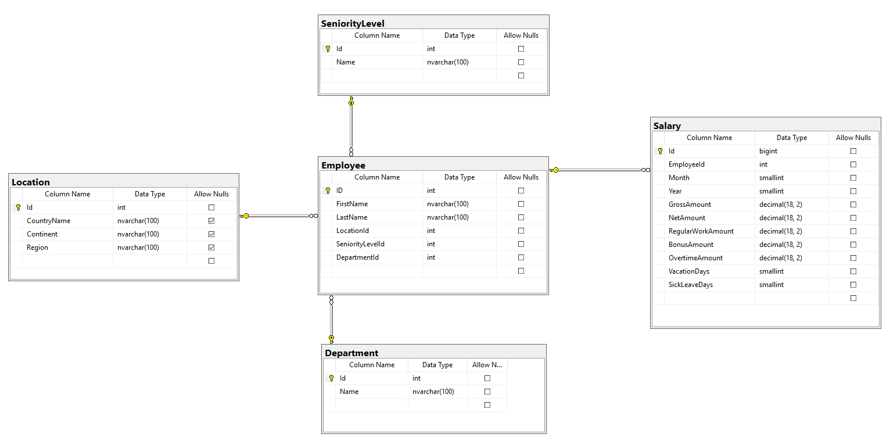

# Project Title :
SQL-IT-Commercial-Bank-Project.

## Project Overview :
As an IT department employee in a commercial bank with a global presence, the project involves designing a comprehensive database for salary management of employees worldwide. 
The database will store and manage basic employee information and monthly salary details.

## Project Highlights :
Seniority Levels: Successfully designed and manually inserted 10 distinct seniority levels, providing a structured framework for categorizing employees appropriately.

Locations: Completed the import of location data from the WideWorldImporters database, encompassing country name, continent, and region. Ensured an equitable distribution of employees across approximately 190 locations, optimizing global representation.

Departments: Successfully inserted 10 different departments manually, establishing an effective categorization system for employees based on their roles and responsibilities.

Employee Data: Accomplished the import of comprehensive employee information from the WideWorldImporters database. Ensured a balanced distribution of employees across seniority levels and departments, enhancing the overall organizational structure.

Salary Data Generation: Developed and executed SQL scripts for the generation of salary data spanning the past 20 years (01.2001 to 12.2020). Included randomization of gross and net amounts, computation of regular work amounts, and systematic allocation of bonus, overtime, vacation, and sick leave days.

Data Quality Assurance: Implemented rigorous data validation checks to guarantee accuracy and integrity. Verified that net amounts precisely equaled the sum of regular work amounts, bonus amounts, and overtime amounts. Enforced the correct allocation of vacation days within the specified range of 20 to 30.

## Project Preview :

